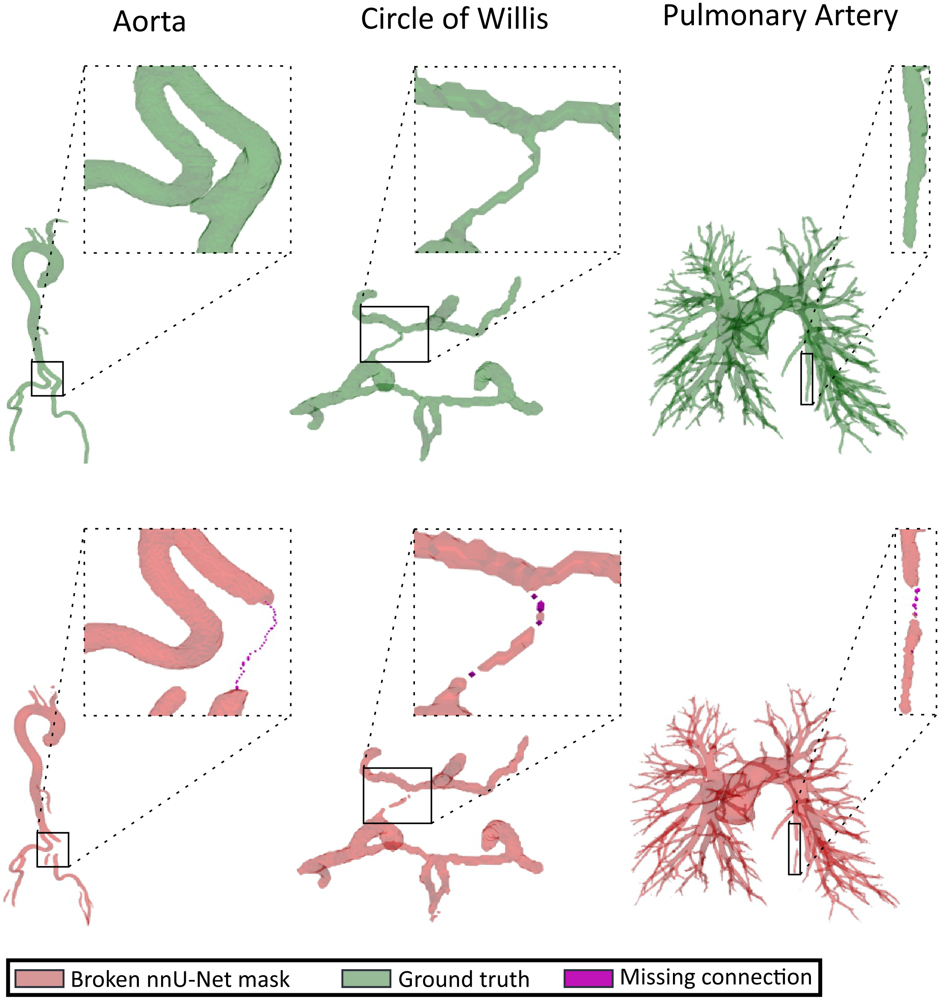
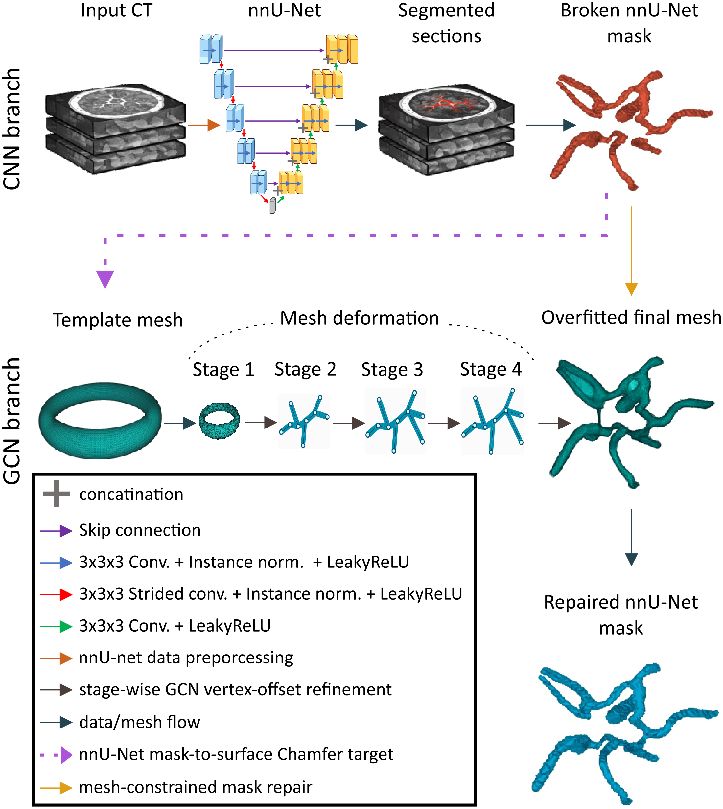
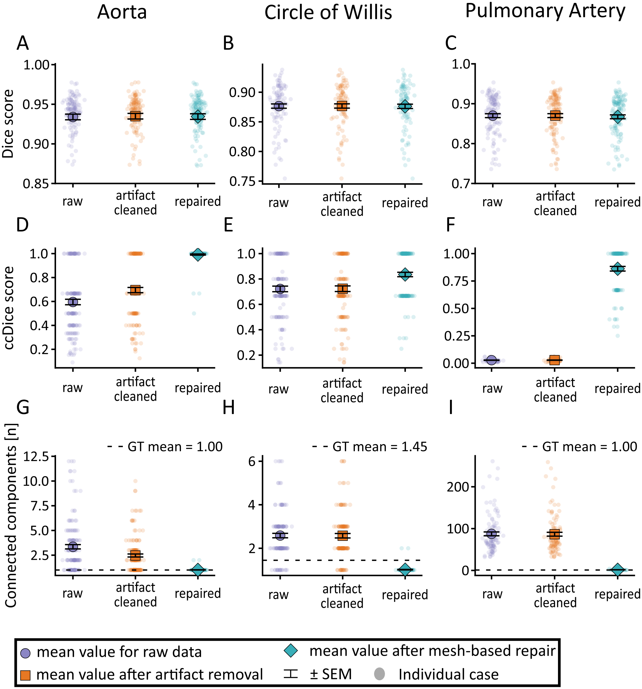
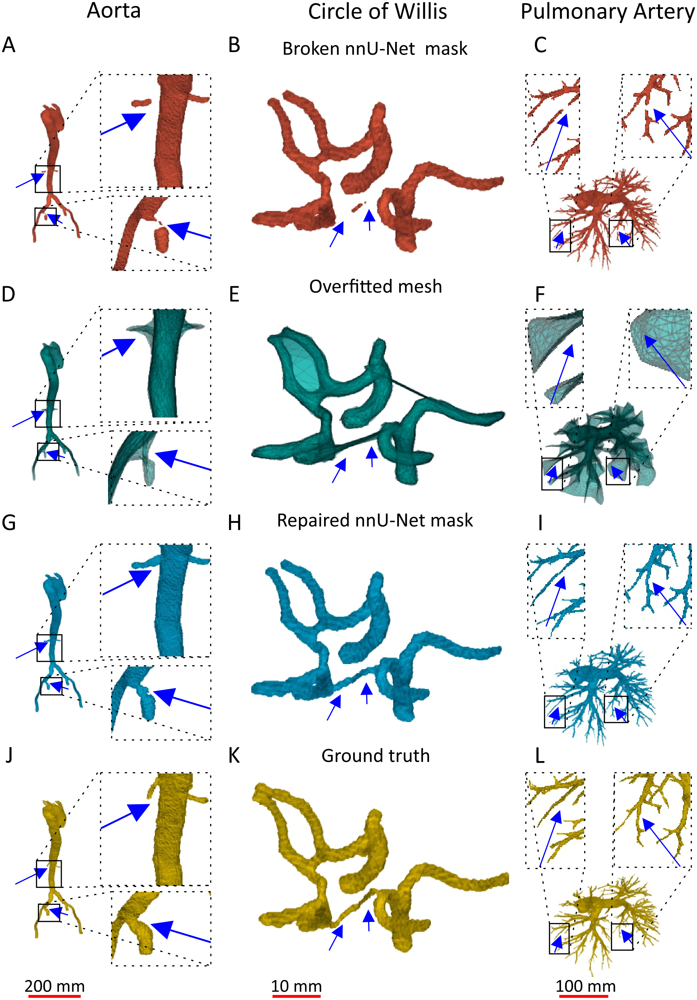
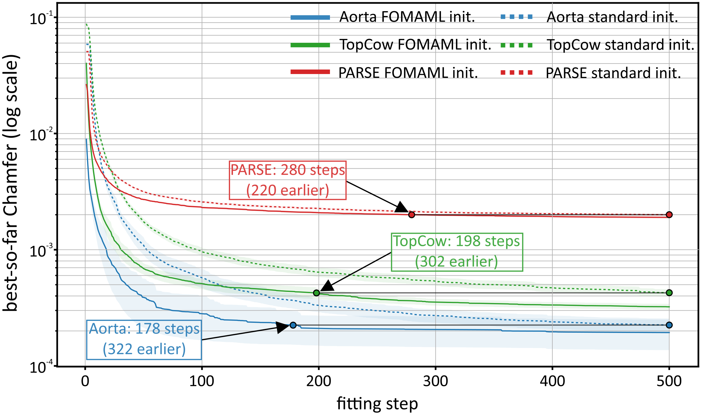

<div align="center">

# Mind the Gap: Mesh-Guided Repair of Broken Vessels

[**Gniewosz Drwiega**](https://orcid.org/0000-0002-1968-2238)<sup>1</sup> · [**Wojciech Szymanski**](https://orcid.org/0009-0001-2043-9104)<sup>1,2</sup> · [**Marek Wodzinski**](https://orcid.org/0000-0002-8076-6246)<sup>1,2</sup>

<sup>1</sup> Sano Centre for Computational Personalised Medicine, Krakow, Poland &nbsp;&nbsp; <sup>2</sup> AGH University of Krakow, Poland

**ShapeMI 2026** · Shape in Medical Imaging workshop at **MICCAI 2026** · Strasbourg, 27 September 2026

[](https://openreview.net/forum?id=BVB2SExfid)
[](https://sanoscience.github.io/mind-the-gap-vessel-repair-page/)
[](https://github.com/SanoScience/mind-the-gap-vessel-repair/actions/workflows/tests.yml)
[](#installation)
[](#installation)



</div>

**One missing voxel bridge splits a vessel in two while barely changing the volume, so Dice stays high and the vessel is still broken.** This repository contains the post-processing framework from our ShapeMI 2026 paper. Given a binary vessel mask predicted by nnU-Net, we fit a deformable template mesh to the mask surface in physical space and use the fitted mesh as a case-specific geometric scaffold. The mesh is **never voxelised as the output**. It only proposes and validates thin bridges between disconnected components, each accepted under a strict foreground-growth budget. Connectivity is restored while voxel accuracy is untouched.

> **Reproducing the paper.** The tag [`v0.1.0-shapemi2026`](https://github.com/SanoScience/mind-the-gap-vessel-repair/releases/tag/v0.1.0-shapemi2026) is the state of the code that produced the published results. Later commits restructure the code without changing what it computes, which the regression tests below check voxel for voxel.

## Highlights

- **Drop-in post-processing.** Works on hard binary masks only. No retraining of the segmentation model, no image intensities, no probability maps.
- **Per-case mesh fitting.** A four-stage graph-convolutional decoder deforms an anatomy-specific template (cylinder, torus or sphere) under a Chamfer loss with edge-length, Laplacian, normal-consistency and face-area regularisation. No mesh model has to generalise across patients.
- **Conservative repair.** Two bridge strategies (mesh-graph shortest path, and endpoint bridges validated by the mesh) rasterise thin tubes that are kept only if they merge components within a per-bridge growth limit.
- **Large connectivity gains at zero Dice cost.** Dice moves by at most 0.003 on every dataset while ccDice rises from 0.596 to 0.992 (aorta), 0.722 to 0.835 (Circle of Willis) and 0.028 to 0.862 (pulmonary arteries).
- **Fast enough to use.** FOMAML meta-initialisation cuts per-case fitting from thousands to a few hundred steps: about 30 s per aortic case, against 44 s for the nnU-Net inference it post-processes.

## How it works

<div align="center">

</div>

1. **Surface target.** The nnU-Net mask is loaded with SimpleITK so spacing, origin and direction are kept. Marching cubes extracts the surface, which is mapped to physical coordinates and normalised by its bounding box.
2. **Mesh fitting.** A template mesh is passed through a four-stage graph decoder. Each stage predicts bounded vertex offsets from the current positions and trainable per-vertex features. The decoder weights, latent code and per-vertex features are optimised for this one case; the mesh with the lowest Chamfer distance is kept and mapped back to image space.
3. **Mesh-guided repair.** Disconnected mask components are reconnected with thin bridges. *Mesh-graph path repair* anchors components to nearby mesh vertices and follows the shortest path on the mesh graph (aorta, TopCoW). *Endpoint repair with mesh validation* proposes short bridges between component boundary points and keeps only those supported by nearby mesh vertices or face centroids (PARSE). Every bridge is accepted only if it actually merges the components and adds fewer voxels than the growth limit.
4. **Filtering and cleanup.** Optional component-distance filtering removes far false-positive islands before fitting; a mesh-supported cleanup removes small components left unsupported by the fitted mesh after repair.
5. **FOMAML meta-initialisation.** Each training case is a fitting task. The model adapts to support surface points for a few inner steps and the shared initialisation is updated from the query loss (first-order MAML). At inference the learned initialisation is a warm start for per-case fitting.

A detailed description of every stage, its parameters and its output files is in [docs/technical_overview.md](docs/technical_overview.md).

## Results

Five-fold out-of-fold protocol: every repaired case was segmented by an nnU-Net model that never saw it during training. Values are mean ± 95% confidence interval. β<sub>0</sub> is the number of connected components; FB is the false-branch fraction.

| Dataset | Mask | Dice ↑ | ccDice ↑ | β<sub>0</sub> ↓ | FB ↓ |
| --- | --- | ---: | ---: | ---: | ---: |
| **Aorta** (n = 145) | Raw nnU-Net | 0.934 ± 0.007 | 0.596 ± 0.045 | 3.35 ± 0.43 | 0.056 ± 0.009 |
| SEGA + AortaSeg24 | Filtered | **0.935 ± 0.007** | 0.695 ± 0.043 | 2.47 ± 0.30 | **0.044 ± 0.008** |
| | Repaired | 0.934 ± 0.007 | **0.992 ± 0.009** | **1.01 ± 0.02** | 0.055 ± 0.009 |
| **TopCoW** (n = 125) | Raw nnU-Net | **0.870 ± 0.010** | 0.722 ± 0.043 | 2.58 ± 0.20 | **0.040 ± 0.006** |
| Circle of Willis | Filtered | **0.870 ± 0.010** | 0.723 ± 0.043 | 2.58 ± 0.20 | **0.040 ± 0.006** |
| | Repaired | 0.867 ± 0.010 | **0.835 ± 0.034** | **1.02 ± 0.02** | 0.063 ± 0.007 |
| **PARSE** (n = 100) | Raw nnU-Net | **0.877 ± 0.007** | 0.028 ± 0.002 | 87.46 ± 9.00 | 0.130 ± 0.020 |
| Pulmonary arteries | Filtered | **0.877 ± 0.007** | 0.028 ± 0.002 | 86.56 ± 8.97 | **0.129 ± 0.020** |
| | Repaired | 0.876 ± 0.007 | **0.862 ± 0.041** | **1.56 ± 0.21** | 0.132 ± 0.020 |

<div align="center">

<p><i>Per-case view. Dice (top) is unchanged, ccDice (middle) jumps, and component counts (bottom) collapse to the ground-truth level (dashed line). Points are individual cases; markers show the mean ± SEM.</i></p>
</div>

<div align="center">

<p><i>Rows: broken nnU-Net mask, overfitted mesh, repaired mask, ground truth. Blue arrows mark the breaks repaired by the method. The mask is untouched away from the bridges.</i></p>
</div>

<div align="center">

<p><i>FOMAML meta-initialisation reaches the 500-step error of the standard initialisation after 178 (aorta), 198 (TopCoW) and 280 (PARSE) steps, and had a lower Chamfer loss at every checkpoint on all 25 held-out TopCoW cases.</i></p>
</div>

**Known trade-off.** On TopCoW the false-branch fraction rises from 0.040 to 0.063: restoring connectivity in the Circle of Willis occasionally adds a spurious branch. See the paper's discussion for limitations and planned work (learned bridge scoring, anatomical constraints, image-based bridge validation).

## Installation

Python 3.10 or newer and a CUDA-capable GPU are expected (the code runs on CPU, but per-case fitting is slow there).

```bash
git clone https://github.com/SanoScience/mind-the-gap-vessel-repair.git
cd mind-the-gap-vessel-repair
python -m venv .venv && source .venv/bin/activate

# 1. PyTorch with the CUDA build matching your driver (see https://pytorch.org/get-started/locally/)
pip install torch torchvision

# 2. Python dependencies
pip install -r requirements.txt

# 3. CUDA Chamfer distance (compiled against your torch build)
pip install git+https://github.com/krrish94/chamferdist.git

# 4. MultiGeoMed: our group's geometric deep-learning library (mesh regularisers, optional voxeliser)
git clone https://github.com/MWod/multigeomed_library.git && pip install -e multigeomed_library

# 5. Optional: CUDA farthest-point sampling for --target-sampling fps
pip install "git+https://github.com/erikwijmans/Pointnet2_PyTorch.git#subdirectory=pointnet2_ops_lib"

# 6. This package
pip install -e .
```

Without `pointnet2_ops` the code falls back to random target sampling, which is what all paper experiments used (`--target-sampling random`).

Baseline segmentations were produced with [nnU-Net v2](https://github.com/MIC-DKFZ/nnUNet) (3D full-resolution configuration, default trainer). The repair stage only needs the predicted binary masks as `<case_id>.nii.gz` files in one folder.

## Quick start

### Fit a mesh and repair one case

The command below reproduces the paper configuration for an aortic case: a 6000-step fit of the cylinder template, mesh-graph path repair with adaptive local bridge radius, component-distance filtering and mesh-supported cleanup. Fitting takes about 20 minutes per case on an RTX 5090 (or a few minutes with a FOMAML warm start, see below).

```bash
python -m mask_mesh_fit.fit_case \
  --case-id A046 \
  --mask-dir /path/to/nnunet_predictions \
  --template templates/aorta_cylinder_10k.npz \
  --output-dir runs/aorta/A046 \
  --device cuda \
  --target-sampling random \
  --fit-steps 6000 \
  --detail-lr 0.006 \
  --coarse-target-points 8192 --detail-target-points 8192 \
  --decoder-stage-max-offsets 0.35 0.20 0.10 0.05 \
  --detail-lambda-edge 0.03125 \
  --detail-lambda-laplacian 1.25 \
  --detail-lambda-normal 2.5e-4 \
  --detail-lambda-face-area-var 2.5e-5 \
  --geometric-repair-method mesh_path_connect \
  --mask-artifact-filter component_distance \
  --artifact-keep-near-main-mm 57.0 --artifact-remove-distance-mm 57.5 --artifact-max-remove-voxels 0 \
  --path-repair-anchor-mm 3.0 \
  --path-repair-radius-mm 1.0 --path-repair-min-accept-radius-mm 2.0 --path-repair-max-radius-mm 5.0 \
  --path-repair-radius-mode adaptive_local --path-repair-radius-percentile 80 --path-repair-radius-scale 1.0 \
  --path-repair-min-component-voxels 1 \
  --path-repair-max-added-fraction 0.03 \
  --post-repair-cleanup remove_mesh_uncovered_components \
  --post-cleanup-max-remove-voxels 1000
```

`--fit-steps N` runs one N-step optimisation with the detail-stage settings (learning rate, target points and regularisation weights given by the `--detail-*` flags). Leave it at 0 to use the staged align/coarse/detail schedule instead.

### Fit once, repair many times

Repair parameters are cheap to explore once a mesh has been fitted. `repair_case` reuses the saved best-Chamfer mesh and runs in a few seconds:

```bash
python -m mask_mesh_fit.repair_case \
  --case-id A046 \
  --mask-dir /path/to/nnunet_predictions \
  --mesh-npz runs/aorta/A046/fitted_mesh_best_chamfer.npz \
  --output-dir runs/aorta/A046_repair_v2 \
  --geometric-repair-method mesh_path_connect \
  --mask-artifact-filter component_distance \
  --artifact-keep-near-main-mm 57.0 --artifact-remove-distance-mm 57.5 --artifact-max-remove-voxels 0 \
  --path-repair-anchor-mm 3.0 \
  --path-repair-radius-mm 1.0 --path-repair-min-accept-radius-mm 2.0 --path-repair-max-radius-mm 5.0 \
  --path-repair-radius-mode adaptive_local \
  --path-repair-min-component-voxels 1 \
  --path-repair-max-added-fraction 0.03 \
  --post-repair-cleanup remove_mesh_uncovered_components \
  --disable-qa
```

### Dataset-specific settings

All experiments share the decoder (4 stages, GCN layers, 128-d latent and features, stage offsets 0.35 / 0.20 / 0.10 / 0.05, auxiliary stage-loss weight 0.1), random target sampling with 8192 points, 6000 fitting steps, learning rate 0.006 and Chamfer weight 1.0. Repair always used 26-connectivity, a 6.0 mm local radius window, a minimum component size of 1 voxel, and cleanup with a 2.0 mm mesh distance and 0.01 minimum close fraction. Only the entries below change between anatomies.

| | Aorta (SEGA + AortaSeg24) | TopCoW (Circle of Willis) | PARSE (pulmonary arteries) |
| --- | --- | --- | --- |
| Template | `templates/aorta_cylinder_10k.npz` | `templates/topcow_torus_10k.npz` | `templates/parse_sphere_20k.npz` |
| `--detail-lambda-edge` | 0.03125 | 0.000625 | 0.1 |
| `--detail-lambda-laplacian` | 1.25 | 0.025 | 5.0 |
| `--detail-lambda-normal` | 2.5e-4 | 2.5e-4 | 1.0e-3 |
| `--detail-lambda-face-area-var` | 2.5e-5 | 2.5e-5 | 5.0e-4 |
| `--geometric-repair-method` | `mesh_path_connect` | `mesh_path_connect` | `mask_endpoint_connect` |
| Artifact filter keep / remove (mm) | 57.0 / 57.5 | 57.0 / 57.5 | 20.0 / 25.0 |
| Bridge anchoring | `--path-repair-anchor-mm 3.0` | `--path-repair-anchor-mm 3.0` | `--endpoint-repair-max-gap-mm 12.0`, `--endpoint-repair-mesh-support-mm 3.0`, `--endpoint-repair-min-mesh-support-fraction 0.50` |
| Tube radius base / min-accept / max (mm) | 1.0 / 2.0 / 5.0 | 0.25 / 0.35 / 1.0 | 0.4 / 0.7 / 1.8 |
| Adaptive radius percentile / scale | 80 / 1.0 | 80 / 0.7 | 70 / 0.8 |
| `--path-repair-max-added-fraction` | 0.03 | 0.15 | 0.06 |
| `--post-cleanup-max-remove-voxels` | 1000 | 1000 | 200 |

For example, the PARSE repair stage of the command above becomes:

```bash
  --geometric-repair-method mask_endpoint_connect \
  --mask-artifact-filter component_distance \
  --artifact-keep-near-main-mm 20.0 --artifact-remove-distance-mm 25.0 \
  --endpoint-repair-max-gap-mm 12.0 --endpoint-repair-mesh-support-mm 3.0 --endpoint-repair-min-mesh-support-fraction 0.50 \
  --path-repair-radius-mm 0.4 --path-repair-min-accept-radius-mm 0.7 --path-repair-max-radius-mm 1.8 \
  --path-repair-radius-mode adaptive_local --path-repair-radius-percentile 70 --path-repair-radius-scale 0.8 \
  --path-repair-max-added-fraction 0.06 \
  --post-repair-cleanup remove_mesh_uncovered_components --post-cleanup-max-remove-voxels 200
```

The template choice matters: a topology that invites a false bridge can make the fitted mesh propose a wrong connection, while a template without a needed loop or branch makes repair too conservative. See [templates/README.md](templates/README.md).

### FOMAML meta-initialisation

Meta-learning needs solved fit states (`mesh_fit_state.pt`) for the training cases, produced by ordinary `fit_case` runs with the same template and stored in run folders named `<case_id>` or `<case_id>_voxelrepair`. The meta-initialisation starts from their average and is refined with first-order MAML:

```bash
python -m mask_mesh_fit.fomaml_meta_init \
  --mask-dir /path/to/nnunet_predictions \
  --template templates/topcow_torus_10k.npz \
  --solved-state-glob "runs/topcow/*/mesh_fit_state.pt" \
  --output-dir runs/topcow/fomaml_meta_init \
  --train-count 100 --val-count 25 \
  --meta-epochs 3 --inner-steps 100 --inner-lr 0.006 \
  --support-points 4096 --query-points 4096 \
  --device cuda
```

The result `meta_init_final.pt` is then used as a warm start, which lets the per-case fit converge in a few hundred steps:

```bash
python -m mask_mesh_fit.fit_case ... \
  --init-fit-state runs/topcow/fomaml_meta_init/meta_init_final.pt \
  --fit-steps 300
```

`compare_chamfer_convergence.py` reads the TensorBoard logs of two sets of runs and produces the convergence comparison shown above. A Reptile variant (`reptile_meta_init.py`) and a second-order MAML variant (`maml_meta_init.py`) are included for completeness. The meta-learned initialisations used in the paper (about 30 MB each) are not part of this repository; contact the corresponding author.

### Evaluation

`evaluate_cleaned_vs_repaired.py` compares the artifact-cleaned and repaired masks of every case against ground truth and writes a CSV plus PDF plots (Dice, largest-component Dice, clDice, false-branch fraction, component counts, skeleton and Euler Betti numbers, ccDice):

```bash
python -m mask_mesh_fit.evaluate_cleaned_vs_repaired \
  --run-root runs/aorta \
  --run-suffix-filter _repair_v2 \
  --gt-dir /path/to/ground_truth \
  --repaired-filename repaired_mask_mesh_path_connect.nii.gz \
  --output-dir results/aorta
```

`--run-suffix-filter` selects the per-case run folders `<case_id><suffix>` under `--run-root`. Use `--repaired-filename repaired_mask_endpoint_connect.nii.gz` for the endpoint variant.

### Smoke test

To check the installation in about a minute, shrink the optimisation and skip the mesh voxelisation:

```bash
python -m mask_mesh_fit.fit_case \
  --case-id A046 --mask-dir /path/to/nnunet_predictions \
  --template templates/aorta_cylinder_10k.npz --output-dir runs/smoke/A046 \
  --device cuda --fit-steps 20 --target-sampling random \
  --coarse-target-points 512 --detail-target-points 512 \
  --skip-voxelize
```

## Outputs

Each run folder contains the fitted meshes, the repaired masks as NIfTI files with the original geometry, and a `metrics.json` with the full configuration, timings and repair statistics.

| File | Content |
| --- | --- |
| `fitted_mesh_best_chamfer.npz` | Fitted mesh (physical coordinates) selected by lowest Chamfer distance; input to `repair_case` |
| `fitted_mesh_stage{1,2,3}.npz`, `fitted_mesh_detail.npz` | Intermediate decoder stages and the last-step mesh |
| `mesh_fit_state.pt` | Decoder weights, latent code and per-vertex features, reusable through `--init-fit-state` |
| `artifact_cleaned_mask.nii.gz`, `artifact_removed_mask.nii.gz` | Mask after component-distance filtering, and what was removed |
| `mesh_path_bridge_mask.nii.gz` / `endpoint_bridge_mask.nii.gz` | The accepted bridges only |
| `repaired_mask_mesh_path_connect.nii.gz` / `repaired_mask_endpoint_connect.nii.gz` | **Final repaired mask** (after cleanup when enabled) |
| `repaired_mask_*_precleanup.nii.gz`, `post_cleanup_removed_mask.nii.gz` | Repaired mask before cleanup, and the components cleanup removed |
| `qa_overlay.pdf` | Slice overlays for visual inspection (disable with `--disable-qa`) |
| `metrics.json`, `tensorboard/` | Configuration, per-stage losses, accepted/rejected bridges, added voxels, timings |

## Tests

```bash
pip install pytest
pytest tests -m "not golden"
```

The synthetic tests build small phantoms in memory, a straight tube cut by a gap and
a triangulated tube standing in for a fitted mesh, and pin the properties the method
claims: repair reconnects components through the mesh, only ever adds voxels,
declines bridges that exceed the growth budget, and leaves an already-connected mask
alone. They need no dataset, no GPU and no deep-learning stack, and run in under a
second.

A second suite replays finished runs and compares the repaired masks with the stored
ones voxel for voxel. Because each run records its own parameters in `metrics.json`,
a run directory is self-describing and the test rebuilds the command line from it.
Those fixtures are predictions derived from the challenge datasets and cannot be
redistributed, so they are not in this repository; point the tests at your own
results as described in [tests/README.md](tests/README.md).

## Repository layout

```
mask_mesh_fit/
  fit_case.py                      end-to-end per-case mesh fitting and repair
  repair_case.py                   repair from an already fitted mesh
  optimize.py                      four-stage decoder optimisation (Lightning or plain loop)
  mesh_deformation_decoder.py      graph-convolutional mesh decoder with bounded per-stage offsets
  losses.py                        Chamfer term and mesh regularisers (MultiGeoMed backend)
  repair_args.py                   repair command-line flags, shared by both entry points
  repair_pipeline.py               the repair stage itself, shared by both entry points
  bridge_tube.py                   bridge rasterisation and the radius policy, shared by both strategies
  geometry.py, io_utils.py         templates, target surfaces, NIfTI geometry handling
  artifact_filter.py               component-distance filtering of false-positive islands
  mesh_path_repair.py              mesh-graph shortest-path bridges (aorta, TopCoW)
  endpoint_repair.py               endpoint bridges validated by mesh support (PARSE)
  post_repair_cleanup.py           removal of components unsupported by the fitted mesh
  voxelize.py                      mesh voxelisation and SDF baselines (voxel_or, sdf_cc, component_sdf)
  fomaml_meta_init.py              first-order MAML meta-initialisation
  reptile_meta_init.py, maml_meta_init.py   alternative meta-learning variants
  compare_chamfer_convergence.py   convergence plots from TensorBoard logs
  evaluate_cleaned_vs_repaired.py  overlap, component and topology metrics against ground truth
  qa.py                            QA overlay PDFs
mask_mesh_refine/                  experimental learned refiner (not used in the paper)
templates/                         anatomy-specific template meshes used in the paper
tests/                             synthetic tests and the golden-run regression harness
docs/                              paper figures and technical overview
```

## Data

The method was evaluated on four public vascular datasets, with all sub-region labels merged into a single foreground vessel class:

- **SEGA** and **AortaSeg24** (aorta, CTA): [multicenteraorta.grand-challenge.org](https://multicenteraorta.grand-challenge.org/), [aortaseg24.grand-challenge.org](https://aortaseg24.grand-challenge.org/)
- **TopCoW** (Circle of Willis, CTA): [topcow24.grand-challenge.org](https://topcow24.grand-challenge.org/)
- **PARSE** (pulmonary arteries, CTPA): [parse2022.grand-challenge.org](https://parse2022.grand-challenge.org/)

nnU-Net v2 baselines were trained on the Helios PLGrid GPU cluster (one GPU, 16 CPU cores, 120 GB RAM, 48 h wall time); mesh fitting and repair ran on a workstation with an Intel Core Ultra 9 275HX, 32 GB RAM and an NVIDIA GeForce RTX 5090 (24 GB).

## Citation

```bibtex
@inproceedings{drwiega2026mindthegap,
  title     = {Mind the Gap: Mesh-Guided Repair of Broken Vessels},
  author    = {Drwiega, Gniewosz and Szymanski, Wojciech and Wodzinski, Marek},
  booktitle = {Shape in Medical Imaging (ShapeMI 2026), MICCAI 2026 Workshop},
  year      = {2026}
}
```

## Acknowledgements

This work was supported by the National Science Centre, Poland, under Grant "MultiGeoMed" No. 2024/55/D/ST6/02081. We gratefully acknowledge the Polish high-performance computing infrastructure PLGrid (HPC Center: ACK Cyfronet AGH) for providing computational resources and support within computational grant No. PLG/2025/018770.

The graph decoder builds on the mesh-deformation ideas of Voxel2Mesh and MeshDeformNet; the Chamfer distance uses [chamferdist](https://github.com/krrish94/chamferdist); mesh regularisers come from [MultiGeoMed](https://github.com/MWod/multigeomed_library); ccDice follows Rougé et al. (2025).

## License

To be announced before the public release.

## Contact

Gniewosz Drwiega · [g.drwiega@sanoscience.org](mailto:g.drwiega@sanoscience.org)
